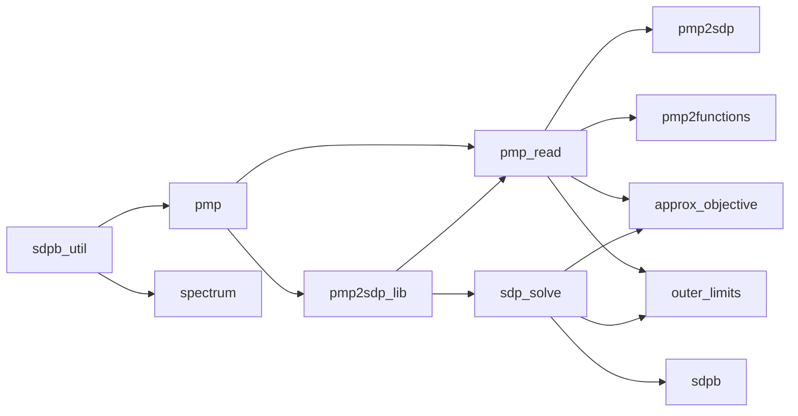
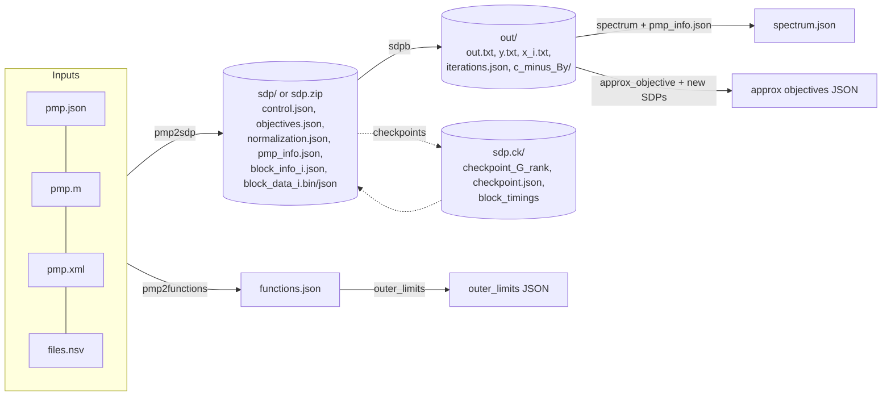

# SDPB Architecture

This document maps the structure of the SDPB code base: what each program does, how the
libraries depend on each other, how data flows from a user's problem description to a
solution, and where the important algorithms live. Paths are relative to the repository
root; `file:line` references point at the most relevant spot.

- Language: C++17 (~23k lines in `src/`), built with [waf](https://waf.io) (`wscript`).
- Parallelism: MPI (one rank per core), plus MPI shared-memory windows inside a node.
- Arithmetic: arbitrary precision everywhere (`El::BigFloat` on top of GMP; MPFR via
  `boost::multiprecision` for some special functions), with an exact multi-modular
  trick to push the hottest matrix product onto double-precision BLAS.

---

## 1. The problem being solved

SDPB solves *polynomial matrix programs* (PMPs), the form that arises in the conformal
bootstrap (`Readme.md`):

> maximize `b0 + b·y` over `y ∈ R^N` such that
> `M_0j(x) + Σ_n y_n M_nj(x) ⪰ 0` for all `x ≥ 0`, `j = 1..J`,

where the `M_nj(x)` are symmetric polynomial matrices (optionally multiplied by a
positive *damped-rational prefactor* `c · base^x / Π(x − pole)`).

Positivity on `x ≥ 0` is turned into a finite semidefinite program by sampling each
polynomial at `d_j + 1` points and introducing bilinear bases (sums-of-squares
certificates). The resulting SDP (see `src/sdp_solve/SDP.hxx:18-72`) is

```
Dual:   maximize  f + b·y
        s.t.      Tr(A_p Y) + (B y)_p = c_p       for all p,   Y ⪰ 0
Primal: minimize  f + c·x
        s.t.      X = Σ_p A_p x_p ⪰ 0,   Bᵀ x = b
```

with `A_(j,r,s,k) = Σ_b v_{b,k} v_{b,k}ᵀ ⊗ E^{rs}` built from the sampled bilinear bases
`v`. Every quantity is **block-diagonal**: one block per PMP constraint `j` (each split
further into an even and odd parity PSD block). That block structure drives the whole
parallel design.

Mathematical background: `docs/SDPB_Manual/SDPB-Manual.pdf`, arXiv:1502.02033 and
arXiv:1909.09745 (scaling), arXiv:2509.14307 (new sampling in 3.1.0).

---

## 2. Repository layout

```
sdpb/
├── wscript, waf, waf-tools/   Build system (waf) + dependency detection scripts
├── src/
│   ├── sdpb_util/             Shared infrastructure (MPI env, timers, JSON, block mapping, ...)
│   ├── pmp/                   PMP data model + sampling / bilinear basis construction
│   ├── pmp_read/              Readers: JSON, Mathematica (.m), XML, NSV file lists
│   ├── pmp2sdp/               PMP → SDP conversion + SDP writers (dir / zip)  [+ pmp2sdp binary]
│   ├── sdp_solve/             SDP data structure, Block_Info, the interior-point solver
│   ├── sdpb/                  The `sdpb` executable (driver, output, timing run)
│   ├── spectrum/              Extract spectrum (zeros of extremal functional) from a solution
│   ├── approx_objective/      Linear/quadratic objective estimates for perturbed SDPs
│   ├── outer_limits/          Experimental point-sampling solver on Chebyshev functions
│   ├── pmp2functions/         PMP → Chebyshev "functions" JSON for outer_limits
│   ├── sdp2input/             DEPRECATED front-end to the pmp2sdp pipeline
│   └── pvm2sdp/               DEPRECATED front-end (legacy XML) to the pmp2sdp pipeline
├── test/
│   ├── run_all_tests.sh       Runs unit_tests (6 MPI ranks) + integration_tests
│   ├── src/{unit_tests,integration_tests,test_util}/   Catch2 tests
│   └── data/                  Reference inputs/outputs (end-to-end, pmp2sdp, outer_limits)
├── external/catch2/           Amalgamated Catch2
├── mathematica/               SDPB.m: Mathematica package to write pmp.json / .m inputs
├── docs/                      Usage, input format, JSON schemas, manual (LaTeX/PDF), site installs
├── Dockerfile, .circleci/     Container build (alpine) and CI (amd64 + arm64, push to DockerHub)
└── Install.md, Changelog.md
```

---

## 3. Build targets and dependency graph

All targets are declared in `wscript`. Every target links `sdpb_util`. External
dependencies: MPI (via `mpicxx`), Boost, GMP (C++), MPFR, the bootstrap-collaboration
fork of **Elemental** (distributed dense linear algebra with `BigFloat`), libxml2,
RapidJSON, libarchive, a CBLAS (OpenBLAS), **FLINT** (multi-modular integer arithmetic)
and **MPSolve** (polynomial roots, used by `spectrum`). `waf-tools/*.py` locates each one.

### Static libraries

| Library       | Sources            | Depends on                   | Role                                            |
|---------------|--------------------|------------------------------|-------------------------------------------------|
| `sdpb_util`   | `src/sdpb_util/`   | externals                    | Environment, timers, archive reader, memory      |
| `pmp`         | `src/pmp/`         | `sdpb_util`                  | PMP model, sample points/scalings, bilinear bases |
| `pmp2sdp_lib` | `src/pmp2sdp/`     | `pmp`                        | `Dual_Constraint_Group`, `Output_SDP`, `write_sdp` |
| `pmp_read`    | `src/pmp_read/`    | `pmp`, `pmp2sdp_lib`         | Parallel PMP readers                             |
| `sdp_solve`   | `src/sdp_solve/`   | `pmp2sdp_lib`                | SDP, Block_Info, SDP_Solver, bigint_syrk         |

(Many `sdpb_util` pieces are header-only; only a handful of `.cxx` files are compiled
into the library — `wscript:33-47`.)

### Executables

| Binary             | Uses                              | Purpose                                              |
|--------------------|-----------------------------------|------------------------------------------------------|
| `pmp2sdp`          | `pmp`, `pmp_read`, `pmp2sdp_lib`  | Convert PMP files into SDPB's SDP input format        |
| `sdpb`             | `sdp_solve`, `mpsolve`            | The solver                                           |
| `spectrum`         | `mpsolve`                         | Spectrum/OPE extraction from an `sdpb` solution       |
| `approx_objective` | `pmp_read`, `sdp_solve`           | Objective under perturbations of (b, c, B)           |
| `outer_limits`     | `pmp_read`, `sdp_solve`           | Alternative iterative point-sampling solver          |
| `pmp2functions`    | `pmp_read`                        | Produce outer_limits input from a PMP                |
| `sdp2input`, `pvm2sdp` | same as `pmp2sdp`             | Deprecated wrappers (print a deprecation warning)     |
| `unit_tests`, `integration_tests` | Catch2 + libs      | Tests (not installed)                                |



---

## 4. End-to-end data flow



Typical session:

```sh
mpirun -n 4 build/pmp2sdp --precision=768 -i pmp.json -o sdp     # PMP → SDP
mpirun -n 4 build/sdpb    --precision=768 -s sdp -o out -c ck     # solve
mpirun -n 4 build/spectrum --precision=768 --pmpInfo=sdp/pmp_info.json \
                           --solution=out --output=spectrum.json  # post-process
```

---

## 5. Shared infrastructure — `src/sdpb_util/`

| Component | What it provides |
|-----------|------------------|
| `Environment` (`Environment.cxx:21-99`) | Wraps `El::Environment` (MPI init). Builds `comm_shared_mem` via `MPI_Comm_split_type(MPI_COMM_TYPE_SHARED)`, computes `node_index()`/`num_nodes()`, records initial node memory, installs a SIGTERM handler (`sigterm_received()`). `set_precision(bits)` sets GMP precision for `El::BigFloat` and matching MPFR digits for `Boost_Float`. |
| `block_mapping/` | Load balancer: `compute_block_grid_mapping` (`compute_block_grid_mapping.hxx:58`) assigns blocks to ranks by cost; `create_mpi_block_mapping_groups` turns it into per-group `El::mpi::Comm`s. Groups never cross node boundaries. See §7.1. |
| `Timers/` | `Timer`, `Timers` (a `std::list` so references stay valid), RAII `Scoped_Timer` that builds hierarchical dotted names like `sdpb.solve.run.iter_2.step.initializeSchurComplementSolver.Q.syrk`. `write_profile()` dumps per-rank profiles. With `--verbosity=debug` also tracks peak `MemUsed`. These timers are also the source of **block timings** used for load balancing. |
| `memory_estimates.cxx`, `Proc_Meminfo` | Read `/proc/meminfo`; estimate memory; auto-choose `--maxSharedMemory` (`memory_estimates.cxx:14`). |
| `Shared_Window_Array<T>` | RAII wrapper over `MPI_Win_allocate_shared` (used by bigint_syrk). |
| `json/` | SAX parsing framework over RapidJSON: `Abstract_Json_Reader_Handler`, object/array parsers with *skip* support (so ranks can ignore blocks they don't own), typed parsers (`Json_Float_Parser`, `Json_Matrix_Parser`, `Json_Damped_Rational_Parser`, …), and `Json_Writer` with full-precision `BigFloat` output. |
| `Archive_Reader` | `std::streambuf` over libarchive — lets every reader treat `sdp.zip`/tar as a directory. |
| `boost_serialization.hxx` | Boost.Serialization for `BigFloat` and `El::Matrix` (binary block data). |
| `copy_matrix`, `write_distmatrix` | Moves between `El::Matrix`, `DistMatrix`, `[STAR,STAR]`; scatter from root. |
| Numeric helpers | `Boost_Float` (MPFR), `Damped_Rational`, `Simple_Matrix<T>`, `fill_weights` (reconstruct full weight vector from `y` + normalization), `cholesky_condition_number`, `Mesh` (adaptive 1-D mesh for outer_limits). |
| `assert.hxx`, `Verbosity.hxx` | `THROW`/`RUNTIME_ERROR`/`ASSERT`/`ASSERT_EQUAL` (with file:line and `boost::stacktrace`), `PRINT_WARNING`; verbosity levels none/regular/debug/trace. Every `main()` catches and calls `El::mpi::Abort`. |
| `ostream/` | `operator<<` for STL containers, `pretty_print_bytes`, precision-aware stream setup. |

---

## 6. Input pipeline: PMP → SDP

### 6.1 Data model — `src/pmp/`

- `Polynomial` (`Polynomial.hxx:27`): `BigFloat` coefficients, low degree first, Horner
  evaluation. `Polynomial_Vector = std::vector<Polynomial>`.
- **`Polynomial_Vector_Matrix`** (`Polynomial_Vector_Matrix.hxx:33`) — one positivity
  constraint = one SDP block: a symmetric `Simple_Matrix<Polynomial_Vector>` (each entry
  holds `N+1` polynomials), `prefactor` and `reduced_prefactor` (`Damped_Rational`),
  `sample_points`, `sample_scalings`, `reduced_sample_scalings`, and a pair of bilinear
  bases (even/odd). The constructor fills in anything the input omits
  (`Polynomial_Vector_Matrix.cxx:126-196`): default prefactor `e^{-x}`, `maxNumPoles`
  down-sampling, `num_points = max_degree + 1 + #reduced_poles − #poles`, sample points,
  scalings and bases.
- `convert/`:
  - `sample_points.cxx` — analytic sample points minimising interpolation error on
    `[0,∞)` for the given prefactor (Newton solve for a density parameter, then roots of
    the integrated density; see arXiv:2509.14307).
  - `sample_scalings.cxx` — evaluate the damped rational at each point.
  - `bilinear_basis/bilinear_basis.cxx` — orthogonal polynomials w.r.t. the discrete
    measure (Cholesky of a Hankel moment matrix + triangular solve); warns when the
    condition number exceeds `2^{prec/2}`.
- **`Polynomial_Matrix_Program`** (`Polynomial_Matrix_Program.hxx:17`): `objective`,
  optional `normalization`, `num_matrices` (global), and only the **rank-local** matrices
  with a `matrix_index_local_to_global` map. Move-only.
- `PMP_Info`/`PVM_Info` (`PMP_Info.hxx`): per-block metadata written to `pmp_info.json`
  and later consumed by `spectrum`.

### 6.2 Readers — `src/pmp_read/`

Entry point: `read_polynomial_matrix_program(env, files, max_num_poles, …)`
(`read_polynomial_matrix_program.cxx:122`).

1. **Expand NSV lists** — `collect_files_expanding_nsv`: `.nsv` files are `\0`-separated
   file lists (recursively expandable, relative to the NSV's directory).
2. **Distribute files** — weight files by size, map them onto per-node process groups
   with the same `compute_block_grid_mapping` used by the solver; within a group,
   matrices are split round-robin (`:166-171`).
3. **Dispatch by extension** — `PMP_File_Parse_Result::read` (`PMP_File_Parse_Result.cxx:30-49`):
   - `.json` → `read_json/` — RapidJSON SAX (`Json_PMP_Parser`,
     `Json_Positive_Matrix_With_Prefactor_Parser`), skipping matrices the rank doesn't own.
     Keys: `objective`, `normalization`, `PositiveMatrixWithPrefactorArray` with
     `polynomials`, `prefactor`/`DampedRational`, `reducedPrefactor`, `maxNumPoles`,
     `samplePoints`, `sampleScalings`, `reducedSampleScalings`, `bilinearBasis[_0|_1]`.
     Schema: `docs/json_schema/pmp_schema.json`.
   - `.m` → `read_mathematica/` — memory-mapped file (`boost::interprocess`) plus a
     hand-written scanner for `SDP[objective, normalization, {PositiveMatrixWithPrefactor[…]…}]`.
   - `.xml` → `read_xml/` — legacy format, libxml2 SAX with a hand-written state machine
     (`Xml_Parser`, `Number_State`, `Vector_State`). No prefactor, no normalization.
4. **Assemble globally** — per-file matrix counts are `AllReduce`d to compute global
   indices; objective/normalization are broadcast from the first rank that has them and
   checked for consistency across files (`check_and_broadcast_vector`, `:54-97`).

### 6.3 Conversion and writing — `src/pmp2sdp/`

- **Driver** (`pmp2sdp/main.cxx:41-47`): `read_polynomial_matrix_program` → `Output_SDP`
  → `write_sdp`. Options (`Pmp2sdp_Parameters.cxx`): `-i`, `-o`, `-p/--precision`,
  `--maxNumPoles`, `-f/--outputFormat bin|json` (default `bin`), `-z/--zip`, `-v`.
- **`Output_SDP`** (`Output_SDP/Output_SDP.cxx:77-149`): eliminates the normalization.
  With `k = argmax|n_i|`: `objective_const = a_k/n_k`, `b_i = a_i − n_i a_k/n_k`, and each
  polynomial vector is rewritten `P'_0 = P_k/n_k`, `P'_i = P_i − n_i P'_0`. Produces one
  `Dual_Constraint_Group` per local block.
- **`Dual_Constraint_Group`** (`Dual_Constraint_Group/Dual_Constraint_Group.cxx:31-80`):
  samples a block into `P = num_points · dim(dim+1)/2` constraint rows indexed
  `(r ≤ c, k)`: `c_p = s_k P^{rc}_0(x_k)`, `B_{p,n} = −s_k P^{rc}_{n}(x_k)`. Bilinear
  bases are sampled by `sample_bilinear_basis.cxx` (odd parity carries the extra `√x`).
- **`write_sdp`** (`write_sdp.cxx:246-408`): write into `<out>_temp`, each rank writing its
  own blocks; sizes are reduced to verify every block was written exactly once; rank 0
  writes the global files; the directory is then renamed atomically (or packed into a
  zip via `Archive_Writer` with `compression=store`, metadata entries first so SDPB can
  read them before block data).

### 6.4 The SDP on-disk format

```
sdp/                      (or sdp.zip / any libarchive-readable archive)
├── control.json          num_blocks, command line
├── objectives.json       constant (f), b
├── normalization.json    (only if PMP had a normalization; used for z.txt)
├── pmp_info.json         per block: index, path, dim, prefactor(s), sample points/scalings
├── block_info_<i>.json   dim, num_points
└── block_data_<i>.bin    Boost binary archive: precision, B, c, bases_even, bases_odd
    (or .json)            JSON: bilinear_bases_even, bilinear_bases_odd, c, B
```

Notes: the only format "version" guard is the precision stored at the head of each
binary block file — `sdpb` asserts it equals its own `--precision`
(`src/sdp_solve/SDP/read_block_data/SDP_Block_Data.cxx:37-47`). JSON block data can be
read at any precision. Documentation: `docs/SDPB_input_format.md`, schemas in
`docs/json_schema/sdp_*_schema.json`.

### 6.5 Deprecated front-ends

`sdp2input` (`src/sdp2input/main.cxx`) and `pvm2sdp` (`src/pvm2sdp/`) keep old
command-line syntaxes but call exactly the same read → `Output_SDP` → `write_sdp` path.

---

## 7. The solver — `src/sdpb/` + `src/sdp_solve/`

### 7.1 Parallel decomposition

Two levels of parallelism:

1. **Block-level (MPI groups).** Each SDP block is owned by a group of ranks on one node;
   small blocks are packed many-per-rank, large blocks get several ranks. Each group
   builds its own `El::Grid` and stores its blocks as `El::DistMatrix<BigFloat>`.
2. **Global objects.** The Schur-complement "Q" matrix (`N×N`, `N` = number of dual
   variables) couples all blocks; it is a `DistMatrix` over *all* ranks. Scalars
   (objectives, errors, termination) are reduced over `COMM_WORLD`.

**`Block_Info`** (`src/sdp_solve/Block_Info.hxx:14`) holds global `dimensions[j]`,
`num_points[j]`, the local `block_indices`, `mpi_group`/`mpi_comm`, and the size helpers
(`get_schur_block_size = num_points·dim(dim+1)/2`, `get_psd_matrix_block_size(parity)`,
`get_bilinear_pairing_block_size`, …).

**Load balancing** (`Block_Info/allocate_blocks.cxx`,
`sdpb_util/block_mapping/compute_block_grid_mapping.hxx:1-58`): block costs come from a
`block_timings` file if present (checkpoint copy preferred — this keeps the mapping
identical on restart), else from a memory-based estimate (`read_block_costs.cxx:85-127`).
Heuristic: sort by cost; blocks with `num_procs·cost > total_cost` get
`≈ cost·num_procs/total_cost` ranks on the node with most free ranks; leftover ranks go to
the most loaded multi-rank map; remaining small blocks are placed greedily on the
least-loaded single-rank map. Integer arithmetic keeps it deterministic across ranks.

**Timing run** (`src/sdpb/main.cxx:86-151`): with >1 rank and no `block_timings` or
checkpoint, `sdpb` first runs 2 iterations with termination disabled, writes measured
per-block timings to `ck/block_timings` (iteration 1 is discarded: many values are zero
and unrepresentatively fast), rebuilds `Block_Info` from them, and then starts the real solve.

### 7.2 Driver — `src/sdpb/`

- `main.cxx:31`: `Environment` → `SDPB_Parameters` (boost::program_options, optional
  `--paramFile`; defaults `outDir = sdpDir_out`, `checkpointDir = sdpDir.ck`) →
  `set_precision` → `Block_Info` → optional timing run → `solve()`.
- `solve.cxx:23`: build `El::Grid(block_info.mpi_comm)`, `SDP`, `SDP_Solver`; `run()`;
  final checkpoint (unless `--noFinalCheckpoint`; always on SIGTERM); `save_solution`.
- `save_solution.cxx:8`: rank 0 writes `out.txt` (terminateReason, objectives, gap,
  errors, runtime) and `y.txt`; optional `z.txt` (y lifted back through the
  normalization), `x_<j>.txt`, `X_matrix_*.txt`, `Y_matrix_*.txt` per `--writeSolution`.
  `run()` itself writes `iterations.json` and `c_minus_By/c_minus_By.json`.
- `write_timing.cxx`: `block_timings` and per-rank profiling (`ck.profiling/`, rotated to
  `ck.profiling.0/`).

### 7.3 `SDP` — `src/sdp_solve/SDP.hxx:74`

Local-blocks-only storage: `bilinear_bases` (`2 × num_local_blocks` DistMatrices),
precomputed `bases_blocks`, `free_var_matrix` (B, one horizontal band per block),
`primal_objective_c` (c, `Block_Vector`), `dual_objective_b` (b, duplicated per group),
`objective_const` (f), optional `normalization`.

Reading (`SDP/SDP.cxx:24`, `read_block_data/read_block_data.cxx`): through
`Archive_Reader` if the path is an archive; for each local block, group rank 0 parses
`block_data_<i>` (bin via Boost archive, JSON via `Json_Block_Data_Parser`) into
`SDP_Block_Data`, then scatters into the group's DistMatrices (`copy_matrix_from_root`).

### 7.4 `SDP_Solver` — primal-dual interior-point method

State (`SDP_Solver.hxx:24`): `x` (Block_Vector), `X`, `Y` (`Block_Diagonal_Matrix`, two
PSD blocks per SDP block), `y` (length N, duplicated per local block), residues
(`primal_residues` P, `dual_residues` d), errors, objectives, `duality_gap`, checkpoint
generations. Initial point: load checkpoint, else `x=y=0`, `X = Ω_p I`, `Y = Ω_d I`
(`initialMatrixScale` default 1e20).

Key parameters (`Solver_Parameters.cxx:19-155`): `precision` (400), `maxIterations`
(500), `dualityGapThreshold`/`primalErrorThreshold`/`dualErrorThreshold` (1e-30),
`feasibleCenteringParameter` (0.1), `infeasibleCenteringParameter` (0.3),
`stepLengthReduction` (0.7), `maxComplementarity` (1e100), `checkpointInterval` (3600 s),
`maxSharedMemory` (0 = automatic), `findPrimalFeasible`/`findDualFeasible`,
`detectPrimalFeasibleJump`/`detectDualFeasibleJump`, `maxRuntime`.

**Iteration** (`SDP_Solver/run/run.cxx:322-467`):

```
loop:
  if any rank got SIGTERM (AllReduce OR)  → write c_minus_By, stop
  if checkpointInterval elapsed           → save_checkpoint, save_c_minus_By
  compute_objectives        primal = f + c·x, dual = f + b·y, gap = |P−D| / max(|P|+|D|,1)
  cholesky_decomposition    X = L_X L_Xᵀ, Y = L_Y L_Yᵀ (per PSD block)
  compute_bilinear_pairings A_X_inv = (L_X⁻¹ V)ᵀ(L_X⁻¹ V),  A_Y = Vᵀ Y V
  residues                  d = c − Tr(A·Y) − B y
                            P = Σ A_p x_p − X,   p = b − Bᵀ x   (global reduction)
  compute_feasible_and_termination   → maybe stop
  step():
    initialize_schur_complement_solver
      S_j   = Schur complement block from A_X_inv, A_Y        (compute_schur_complement.cxx)
      S_j   = L_j L_jᵀ ;  schur_off_diagonal_j = L_j⁻¹ B_j    (compute_Q.cxx:9-61)
      Q     = Σ_j (L_j⁻¹B_j)ᵀ (L_j⁻¹B_j)                       ← bigint_syrk (§7.5)
      Q     = Cholesky(Q)                                    (global DistMatrix)
    μ = Tr(XY)/dim;  abort if μ > maxComplementarity
    predictor: β_p = 0 (feasible) or infeasibleCentering;   compute_search_direction
    corrector: β_c from r = Tr((X+dX)(Y+dY))/(μ·dim)          compute_search_direction
               with R −= dX dY  (Mehrotra predictor–corrector)
    step lengths α_P, α_D from min eigenvalue of L⁻¹ dX L⁻ᵀ  (step_length/)
      scaled by stepLengthReduction; equalised when primal & dual feasible
    x += α_P dx,  X += α_P dX,  y += α_D dy,  Y += α_D dY
    AllReduce block_timings
  print_iteration → stdout + iterations.json
```

`compute_search_direction` (`step/compute_search_direction/`): `R = βμI − XY [− dXdY]`,
`Z = sym(X⁻¹(PY − R))`, RHS `dx = −d − Tr(A_p Z)`, `dy = p`; then
`solve_schur_complement_equation` does the block-L solve, a global
`dy −= Σ (L⁻¹B)ᵀ dx`, `cholesky::SolveAfter(Q)`, back-substitution; finally
`dX = P + Σ A_p dx_p` and `dY = −sym(X⁻¹(dX·Y − R))`.

**Termination reasons** (`SDP_Solver_Terminate_Reason.hxx:8`, checked in
`compute_feasible_and_termination.cxx:4` in priority order): PrimalDualOptimal,
DualFeasible, PrimalFeasible, DualFeasibleJumpDetected, PrimalFeasibleJumpDetected,
MaxIterationsExceeded, MaxRuntimeExceeded, PrimalStepTooSmall, DualStepTooSmall; plus
MaxComplementarityExceeded (from `step`) and SIGTERM_Received.

### 7.5 `bigint_syrk` — computing Q exactly with double-precision BLAS

The dominant cost in large runs is `Q = PᵀP` with `P = L⁻¹B` in multiprecision. SDPB
turns it into many exact double-precision BLAS calls. Full design notes:
`src/sdp_solve/SDP_Solver/run/bigint_syrk/Readme.md`.

1. **Normalize** (`Matrix_Normalizer.cxx`): divide each column of P by its global norm
   (`AllReduce`) and multiply by `2^prec`, so P' holds big integers. Afterwards,
   `Q_ij = (Q'_ij / 2^{2·prec}) · n_i n_j`; the diagonal of Q' must be ≈ `2^{2·prec}`
   (a built-in sanity check).
2. **Choose primes** (`fmpz/Fmpz_Comb.cxx`, wrapping FLINT `fmpz_comb_t`): each prime
   satisfies `p²·k < 2^53` (`k` = total block height on the node) so a `dsyrk` over
   residues is exact in doubles; their product exceeds `2^{2·prec + bits(k) + 1}`.
3. **Residues into shared memory** (`compute_block_residues.cxx`): every rank on a node
   writes `P'_block mod p` for its blocks into an MPI shared-memory window
   (`Block_Residue_Matrices_Window`, layout `[prime][block]`), using local buffers and
   `memcpy` for bulk writes.
4. **BLAS jobs** (`blas_jobs/`, `bigint_syrk_blas.cxx`): all node ranks cooperatively
   compute `Q_node mod p` for all primes into `Residue_Matrices_Window` with `cblas_dsyrk`
   (diagonal tiles) and `cblas_dgemm` (off-diagonal tiles). Most primes are one whole-matrix
   job each; the leftover `num_primes % num_ranks` primes are split into `M×M` tiles, and
   `create_blas_job_schedule` tries `M..M+4`, scheduling each with greedy
   Longest-Processing-Time (`LPT_scheduling.hxx`) and keeping the best makespan.
   Windows are "first-touched" according to the schedule for NUMA locality.
5. **Restore and reduce** (`restore_and_reduce.cxx`): the owner of each `Q(i,j)` restores it
   from residues via CRT (`fmpz_multi_CRT_ui`); across nodes, the node contributions are
   summed with a reduce-scatter-like `SendRecv` ring into the global `DistMatrix` Q.
6. **Memory control** (`BigInt_Shared_Memory_Syrk_Context.cxx:149-213`): given
   `--maxSharedMemory` (auto: ~50% of free RAM), choose the smallest *output* split factor
   (Q tiles, identical across nodes) and then the smallest *input* split factor (process P
   rows in chunks). BLAS is forced single-threaded.
7. **Timing attribution**: residue + BLAS time is split among local blocks
   proportionally to their size and added to per-block timings used by load balancing.

### 7.6 Checkpoints

- **Save** (`SDP_Solver/save_checkpoint.cxx:38`): each rank writes
  `checkpoint_<generation>_<rank>` — for x, X, y, Y and each local block: local height,
  width, then `BigFloat::Serialize` bytes (binary to avoid decimal round-off). Rank 0
  writes `checkpoint_new.json` (`current`, `backup`, `version`, solver options) and renames
  it to `checkpoint.json` after a barrier (atomic switch); older generations are deleted.
- **Load** (`load_checkpoint/`): binary first (`load_binary_checkpoint.cxx`, falls back to
  legacy `checkpoint.<rank>`; asserts local dimensions match), else text (`x_*.txt`,
  `y.txt`, `X_matrix_*.txt`, `Y_matrix_*.txt` from `--writeSolution=x,y,X,Y`).
- Binary checkpoints do not record precision, rank count or block mapping; restarts rely
  on the same precision, the same number of ranks and the `block_timings` copied into
  the checkpoint directory (which reproduces the mapping).

### 7.7 Precision

`Environment::set_precision` → `El::gmp::SetPrecision` (GMP `mpf`, rounded up to limbs;
`precision_actual` is logged) and `Boost_Float::default_precision`. FLINT conversions use
`fmpz_set_mpf`/`fmpz_get_mpf`. MPI transport of `BigFloat`s uses
`Serialize`/`Deserialize`. Binary SDP block files must match the solver precision.

---

## 8. Post-processing and auxiliary tools

### 8.1 `spectrum` — `src/spectrum/`

Finds where the extremal functional `c − B·y` degenerates (the spectrum), and optionally
the OPE-coefficient vectors λ. Inputs: `--pmpInfo` (`pmp_info.json`), `--solution`
(sdpb out dir) or `--cMinusBy`, `--precision`, `--threshold` / `--minEigenvalueRatio`
(both default to `sqrt(dualityGap)` read from `out.txt`), `--maxZero`, `--minZeroDistance`,
`--lambda`.

Per block (`compute_spectrum/find_zeros.cxx:170`):
1. Single sample point: min eigenvalue test → zero at `x = 0`.
2. Otherwise divide by `reduced_sample_scalings`, Lagrange-interpolate each matrix
   element, and build `det(c − B·y)(x)` as a polynomial by sampling + interpolation.
3. Find its minima with **MPSolve** (roots of the derivative with positive real part,
   `mpsolve.cxx`), merge roots closer than `minZeroDistance`, drop those above `maxZero`,
   always consider `x = 0`.
4. Accept a minimum as a zero if the (prefactor-scaled) determinant is small relative to
   neighbouring mid-points (`< threshold`).
5. `compute_lambda.hxx`: least-squares fit (SVD) + `HermitianEig`, keep eigenvalues above
   `minEigenvalueRatio · max`, `λ = v·√eig / √χ'(x)` (arXiv:1612.08471, App. A).

Output: `spectrum.json` — `[{block_path, zeros:[{zero, lambda}], error}]`
(`docs/json_schema/spectrum_schema.json`).

### 8.2 `approx_objective` — `src/approx_objective/`

Given a solved SDP and a family of perturbed SDPs (`--newSdp`, possibly an NSV list),
estimates the new objective without re-solving (arXiv:2104.09518).
- `--linear`: `d_objective = Δf + Δb·y + Δc·x − x·ΔB·y` using only `x`, `y`
  (`Approx_Objective.cxx`).
- Quadratic (default): `setup_solver` rebuilds the Schur complement / Q Cholesky with
  `sdp_solve` machinery (needs `X`, `Y` from `--writeSolution=x,y,X,Y`, or a saved
  `--writeSolverState`); `compute_dx_dy` solves for the first-order change of the
  solution, giving `dd_objective`.
Output: JSON on stdout `[{path, objective, d_objective, dd_objective}]`.

### 8.3 `outer_limits` and `pmp2functions`

- `pmp2functions` (single process) turns a PMP into per-block Chebyshev expansions on
  `[0, 8·max(sample_point)]` plus `ε`/`∞` limits (`write_functions.cxx`).
- `outer_limits` is an experimental cutting-plane-style solver: positivity is imposed only
  at a finite set of points per block; an in-memory `SDP` + `SDP_Solver` is solved with a
  progressively tighter duality gap; then `find_new_points` evaluates the weighted sum of
  functions on an adaptive `Mesh` and adds points where the functional goes negative;
  repeat until no new points appear (`compute_optimal/compute_optimal.cxx:55`). Has its own
  gzip'd JSON checkpoints. Docs: `docs/Outer_Limits_Usage.md`, `docs/Outer_Limits/`.

### 8.4 Mathematica front-end — `mathematica/SDPB.m`

A Mathematica package (`WritePmpJson`, `DampedRational`, `PositiveMatrixWithPrefactor`,
…) for writing PMPs as `pmp.json` or `.m`; `Bootstrap2dExample.m` is a worked example.

---

## 9. Testing and CI

- **Framework**: Catch2 (amalgamated in `external/catch2/`), two binaries built by `wscript`.
- **`unit_tests`** (`test/src/unit_tests/`): runs on every MPI rank (must be a multiple of 6
  ranks). Covers block mapping, LPT scheduling, BLAS job schedules, `calculate_matrix_square`
  (bigint_syrk vs. reference), `Matrix_Normalizer`, `copy_matrix`, shared windows, JSON,
  Boost serialization of block data, `Boost_Float`, PMP sampling (vs. Mathematica values).
- **`integration_tests`** (`test/src/integration_tests/`): `Test_Case_Runner` launches the
  real binaries via `boost::process` (with `--mpirun=…`) and logs to `test/out/log/`.
  - `pmp2sdp.test.cxx` — JSON/Mathematica/XML inputs, output formats, error cases.
  - `sdpb.test.cxx` — IO errors, profiling rotation, corrupted inputs/checkpoints.
  - `outer_limits.test.cxx` — `pmp2functions` → `outer_limits` vs. reference.
  - `end-to-end.test.cxx` — `pmp2sdp` → diff SDP → `sdpb` (optionally twice to exercise
    checkpoint restart) → check `c_minus_By` → diff out dir → `spectrum` → diff
    `spectrum.json`, over the datasets in `test/data/end-to-end_tests/`.
  - Comparisons are semantic (C++ `diff_*.cxx` parsers) with a tolerance of
    `2^-diff_precision` relative to magnitude (e.g. solve at 768 bits, compare at 99).
- **Run**: `./test/run_all_tests.sh [mpirun command]`.
- **CI** (`.circleci/config.yml`): builds the Docker image (`Dockerfile`, alpine +
  prebuilt Elemental and FLINT images, MPSolve built from source) for amd64 and arm64,
  runs the test target, and pushes `sdpb:master` / `sdpb:<tag>` to DockerHub.

---

## 10. Where to look for…

| Task | Start here |
|------|------------|
| Add/modify a command-line option for `sdpb` | `src/sdp_solve/Solver_Parameters/`, `src/sdpb/SDPB_Parameters.cxx` |
| Change the IPM step / centering | `src/sdp_solve/SDP_Solver/run/step/` |
| Termination logic | `src/sdp_solve/SDP_Solver/run/compute_feasible_and_termination.cxx` |
| Performance of Q computation / memory | `src/sdp_solve/SDP_Solver/run/bigint_syrk/` (+ its `Readme.md`) |
| Block distribution across ranks | `src/sdpb_util/block_mapping/`, `src/sdp_solve/Block_Info/` |
| New PMP input field | `src/pmp_read/read_json/Json_Positive_Matrix_With_Prefactor_Parser.hxx`, `src/pmp/Polynomial_Vector_Matrix.cxx`, `docs/json_schema/pmp_schema.json` |
| Sampling / bilinear bases / conditioning | `src/pmp/convert/` |
| SDP file format | `src/pmp2sdp/write_*.cxx`, `src/sdp_solve/SDP/read_*` |
| Checkpointing | `src/sdp_solve/SDP_Solver/save_checkpoint.cxx`, `load_checkpoint/` |
| Solver output files | `src/sdpb/save_solution.cxx`, `run/save_c_minus_By.hxx` |
| Spectrum extraction | `src/spectrum/compute_spectrum/` |
| Timing / profiling | `src/sdpb_util/Timers/`, `src/sdpb/write_timing.cxx` |

---

## 11. Known rough edges (observed while mapping)

These are small discrepancies noticed in the current tree, not design issues:

- `docs/json_schema/pmp_schema.json` is not valid JSON (unclosed object near line 140).
- `docs/json_schema/sdp_pmp_info_schema.json` names the field `block_path`, while the
  writer and `spectrum` reader use `path` (plus `index`, `dim`).
- `docs/json_schema/sdp_block_data_schema.json` requires `dim`/`num_points`, which live in
  `block_info_*.json`, not `block_data_*.json`. No schema exists for `normalization.json`,
  and `docs/SDPB_input_format.md` doesn't mention `pmp_info.json`/`normalization.json`.
- `create_blas_job_schedule.cxx:121-124`: the `El::LOWER` branch skips `j < i` just like
  `UPPER` (should presumably skip `j > i`). Harmless today because `compute_Q` always
  passes `El::UPPER`.
- `sdp2input` / `pvm2sdp` are marked deprecated with a TODO to remove them.
- `test/data/approx_objective/` exists but `approx_objective` has no automated test.
